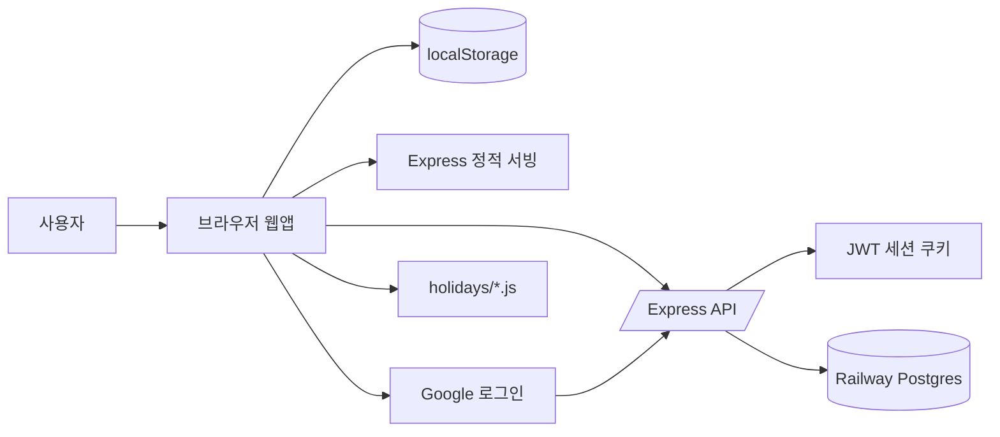
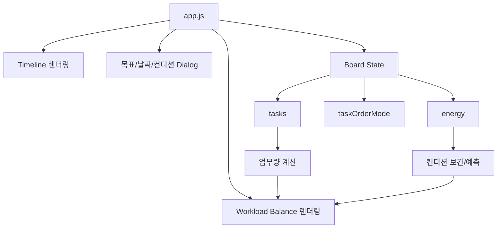
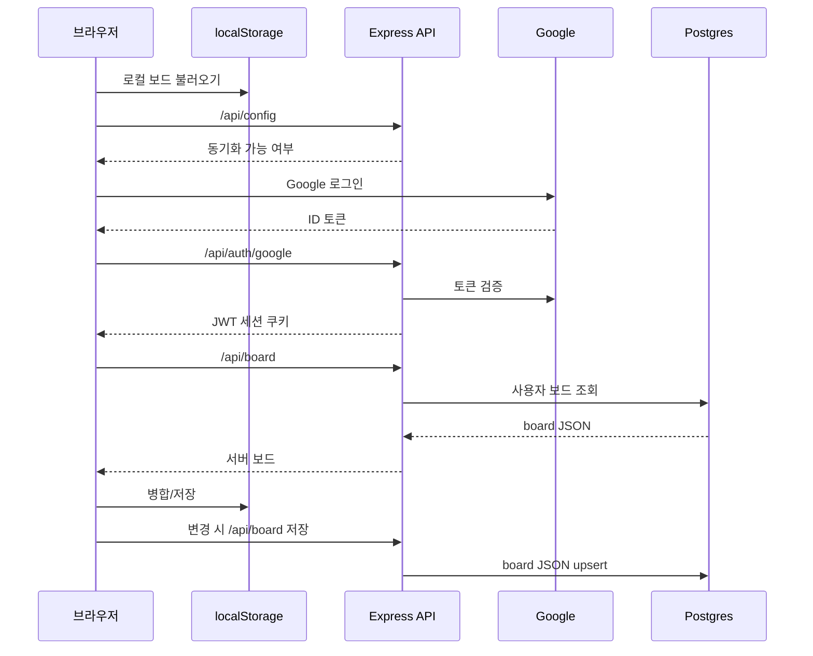
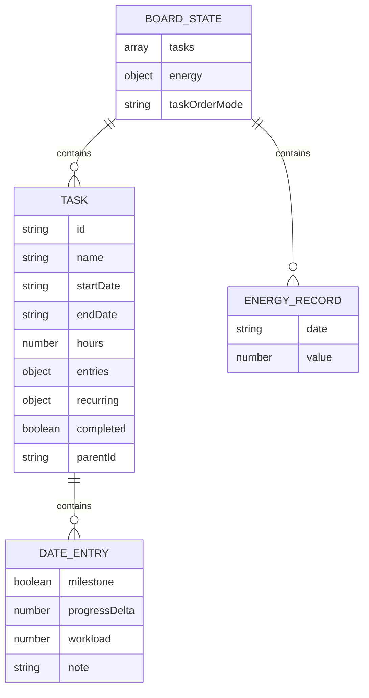

# 업무 · 일정 관리

여러 목표와 회사 업무, 하루 업무량, 그날의 컨디션을 같은 날짜 축에서 한눈에 보는 웹앱입니다.

로그인 없이 브라우저 저장소(`localStorage`)만으로 동작하고, 구글 로그인을 하면 서버(Railway Postgres)에 자동 저장돼 다른 PC에서도 이어서 볼 수 있습니다.

## 실행

**로컬 전용**: `index.html`을 브라우저로 열면 됩니다. 동기화 없이 `localStorage`에만 저장됩니다.

```powershell
start .\index.html
```

**서버 모드(동기화 포함)**: 아래 환경변수를 설정한 뒤 실행합니다.

```powershell
npm install
npm start
# http://localhost:3000
```

**위젯 화면 원형**: 서버 모드에서 아래 주소로 엽니다. 로그인하지 않아도 브라우저 로컬 보드가 있으면 로컬 모드로 표시되고, 로그인하면 서버 동기화 데이터를 우선 사용합니다.

```text
http://localhost:<PORT>/widget.html
```

## 주요 기능

**목표와 타임라인**
- 목표를 추가하고 이름·시작일·종료일을 지정 (종료일은 +1개월/6개월/1년 버튼으로 빠르게 연장)
- 기본 정렬은 종료일 임박순, 행을 드래그하면 수동 정렬
- 컨디션 행 아래에 상시 `회사 업무` 행이 고정되며, 회사 프로젝트는 그 아래 접기/펼치기 그룹으로 표시
- 회사 업무는 평일이면 기록이 없어도 업무량에 반영되고, 회사 프로젝트의 업무량은 회사 업무에 포함
- 정기 일정은 지정한 기간(최소 1개월) 동안 매주 선택한 요일에 반복 표시
- 완료한 목표는 타임라인에서 빠지고 보관함에서 모아 보기(되돌리기·삭제 가능, 그래프 기록은 유지)

**날짜별 기록**
- 날짜 셀을 눌러 마일스톤, 진척률 증감, 업무량, 메모 기록
- 업무량을 비워 두면 목표에 설정한 기본 업무량을, 입력하면 그날 값을 그래프에 반영
- 기록한 셀을 드래그해 다른 날짜로 이동(Ctrl+드래그는 복사), 기간 밖에 기록하면 기간이 자동 확장
- `내 컨디션` 행에서 날짜별 컨디션을 0–120 슬라이더로 기록

**그래프**
- 전체 흐름: 업무량(좌, 0–120%)과 컨디션(우, 0–120)을 같은 축 격자에서 함께 표시
- 목표별 흐름: 각 목표의 마일스톤을 시간순으로 균등 분포한 높이에 다이아몬드로 표시하고 점선으로 연결(진척률 변화 없이 마일스톤만 등록해도 보임)
- 컨디션은 기록 사이를 부드럽게 잇고, 마지막 기록 이후는 점선으로 예측
- 그래프나 타임라인에서 날짜에 마우스를 올리면 양쪽이 함께 강조
- 오늘 날짜 표시, 주말·공휴일 칼럼은 옅은 붉은 배경
- 드래그, 이전/다음 버튼, 트랙패드 좌우 스와이프, `날짜 바로가기`·`오늘로 이동` 버튼으로 날짜 이동

**기타**
- 지정한 기간의 기록을 txt 파일로 내보내기
- `모바일 QR` 버튼으로 현재 주소의 QR을 띄워 휴대폰에서 바로 접속
- 한국 공휴일 표시(토요일 파랑, 일요일·공휴일 빨강)
- 데스크톱/모바일 반응형

## 시스템 아키텍처









## 클라우드 동기화 (Railway + 구글 로그인)

`server.js`(Express)가 정적 프론트와 `/api/*`를 함께 제공합니다. 보드는 사용자별 한 행(JSONB)으로 Postgres `boards` 테이블에 저장됩니다. 로그인하면 서버 데이터를 우선 사용하고, 서버가 비어 있으면 현재 로컬 보드를 올립니다. 우상단 동기화 버튼으로 상태를 확인하거나 즉시 동기화할 수 있습니다.

설정 순서:

1. **Google Cloud Console**에서 OAuth 2.0 클라이언트 ID(웹) 생성
   - 승인된 자바스크립트 출처에 배포 도메인(`https://<앱>.up.railway.app`)과 `http://localhost:3000` 추가
2. **Railway** 프로젝트에 이 저장소를 연결하고 **PostgreSQL** 추가
   - 앱 서비스의 `DATABASE_URL`을 Postgres 서비스 참조(`${{Postgres.DATABASE_URL}}`)로 연결
3. 앱 서비스 **Variables** 설정
   - `GOOGLE_CLIENT_ID` = 1번에서 만든 클라이언트 ID
   - `JWT_SECRET` = 길고 무작위한 문자열
   - `NODE_ENV` = `production`
4. 배포 후 접속 → 우상단 구글 로그인 → 자동 저장·불러오기

환경변수 예시는 `.env.example`을 참고하세요. `GOOGLE_CLIENT_ID`나 `DATABASE_URL`이 없으면 동기화가 꺼지고 `localStorage` 전용으로 동작합니다.

## 데이터 저장

브라우저 `localStorage` 키: `schedule-wave-board`

| 필드 | 내용 |
|------|------|
| `tasks` | 목표 목록(이름·기간·소요 시간·반복 설정·날짜별 기록) |
| `energy` | 날짜별 컨디션 값 |
| `taskOrderMode` | 정렬 상태(`due` 또는 `manual`) |

업무량은 `소요 시간 / 12시간 × 100`(%)으로 계산하며, 날짜 셀에 직접 입력한 업무량이 있으면 그 값을 씁니다. 업무량 축은 컨디션과 맞춰 0–120%로 표시하고, 초과분은 천장에 맞춰 그립니다.

## 공휴일

공휴일은 `holidays/<연도>.js`로 분리되어 있고, 화면에 보이는 연도만 `<script>`로 동적 로드합니다. `fetch`가 아니라 `<script>` 방식이라 `file://`(더블클릭 실행)에서도 동작합니다.

새 연도는 같은 형식의 파일을 추가하면 됩니다(HTML 수정 불필요).

```js
// holidays/2027.js
registerHolidays(2027, {
  "2027-01-01": "신정",
  // ...
});
```

음력·대체·임시 공휴일은 규칙만으로 정확히 산출되지 않으므로 각 연도 파일은 공공데이터포털 KASI 특일정보 API 결과로 미리 만들어 두는 방식을 권장합니다. 해당 연도 파일이 없으면 양력 고정 공휴일(신정·삼일절·어린이날·현충일·광복절·개천절·한글날·성탄절)로 폴백합니다.

## 점검

```powershell
node --check app.js
node --check server.js
```

## 파일 구조

```text
work-schedule-board/
  index.html          화면 마크업
  styles.css          스타일
  app.js              프론트엔드 로직(편집기)
  server.js           Express 서버(정적 서빙 + /api)
  widget.html/js/css  위젯 원형(얇은 클라이언트)
  core/
    board-schema.js   보드 정규화(프론트·서버·위젯 공유)
    board-metrics.js  업무량·컨디션 계산(프론트·서버·위젯 공유)
  holidays/
    2026.js           연도별 공휴일
  package.json
  .env.example        환경변수 예시
  AGENTS.md           AI 협업 영구 계약(규칙의 진실의 원천)
  CLAUDE.md           Claude Code용 얇은 어댑터
  docs/               아키텍처·API·데이터 모델·ADR·로드맵
```

## 문서

| 문서 | 역할 |
|------|------|
| [`AGENTS.md`](AGENTS.md) | AI 협업 영구 계약 — 규칙·불변식·커밋 규칙의 진실의 원천 |
| [`docs/ARCHITECTURE.md`](docs/ARCHITECTURE.md) | 시스템 구조·데이터 흐름·모듈 경계 |
| [`docs/API.md`](docs/API.md) | HTTP 엔드포인트 계약 |
| [`docs/DATA_MODEL.md`](docs/DATA_MODEL.md) | 보드 스키마·동기화·충돌 규칙 |
| [`docs/adr/`](docs/adr/) | 아키텍처 의사결정 기록 |
| [`docs/WIDGET_PLAN.md`](docs/WIDGET_PLAN.md) | 위젯/데스크톱 확장 로드맵 |
