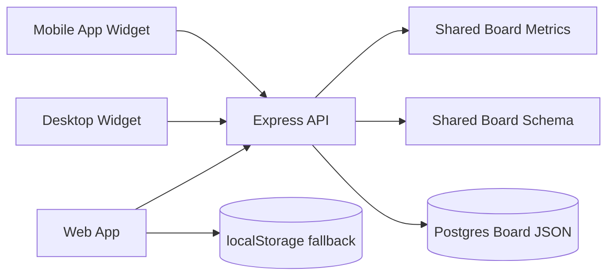

# Widget Roadmap

## Goal

Make the current schedule board usable as:

- a desktop wallpaper/widget style view
- a mobile app widget
- a shared synced dashboard backed by the same board data

The web app remains the main editor. Widgets should be small read/quick-write clients that use the same server data.

## Assumptions

- The current web app remains the source of truth for full editing.
- Server sync is enabled through Google login and Postgres.
- Widgets should not duplicate board calculation logic.
- The first useful widget data is today's workload, condition, status, and active items.
- Manual sync is available on the free plan.
- Auto sync, background widget refresh, and near-real-time multi-device updates are paid features.

## Architecture Direction



## Subscription Boundary

The server should be the source of truth for plan features. The frontend and widgets should only read feature flags.

```mermaid
flowchart LR
  User[User] --> API[/api/me]
  API --> Plan[plan/features]
  Plan --> Web[Web App]
  Plan --> Desktop[Desktop Widget]
  Plan --> Mobile[Mobile Widget]
  Web --> Manual[Manual Sync]
  Web --> Auto[Auto Sync]
  Desktop --> Refresh[Widget Auto Refresh]
  Mobile --> Refresh
  Plan -. free .-> Manual
  Plan -. paid .-> Auto
  Plan -. paid .-> Refresh
```

Initial feature shape:

```json
{
  "plan": "free",
  "features": {
    "manualSync": true,
    "autoSync": false,
    "widgetAutoRefresh": false
  }
}
```

## Phase 1: Widget Data Boundary

Success criteria:

- Shared calculation code exists outside `app.js`.
- Shared board normalization code exists outside `app.js`.
- Server exposes a small widget summary endpoint.
- Existing web app behavior is unchanged.

Tasks:

1. Add `core/board-metrics.js`.
2. Add `core/board-schema.js`.
3. Move or mirror only the minimal workload/condition summary logic needed by widgets.
4. Add `GET /api/widget/today`.
5. Add `GET /api/widget/range`.
6. Verify with `node --check app.js`, `node --check server.js`, and direct module smoke tests.

## Phase 2: Web Widget View

Success criteria:

- A small browser view can show today's summary.
- The view is usable as a desktop always-on-top window later.

Tasks:

1. Add `widget.html`.
2. Add minimal widget CSS.
3. Fetch `/api/widget/range`.
4. Show a translucent calendar, workload/condition wave, active items, and milestones.

## Phase 3: Desktop Widget

Success criteria:

- A desktop wrapper can show `widget.html` in a small persistent window.

Candidate paths:

- Tauri: smaller binary, good for lightweight widget windows.
- Electron: faster to prototype, heavier runtime.

Tasks:

1. Choose Tauri or Electron.
2. Add desktop wrapper project files.
3. Configure small frameless or compact window.
4. Add auto-start later if needed.

## Phase 4: Mobile App Widget

Success criteria:

- Phone widget reads the synced server summary.
- Quick condition input can be added without opening the full web app.

Candidate path:

- Capacitor app wrapper first.
- Native Android/iOS widget extensions later.

Tasks:

1. Add app wrapper only after widget API stabilizes.
2. Implement native widget data fetch.
3. Add quick condition update API.
4. Add mobile build/deploy notes.

## Near-Term API Shape

```text
GET /api/widget/today
GET /api/widget/range
GET /api/widget/week
POST /api/widget/energy
POST /api/widget/quick-entry
```

Start with `GET /api/widget/today` and `GET /api/widget/range`.
