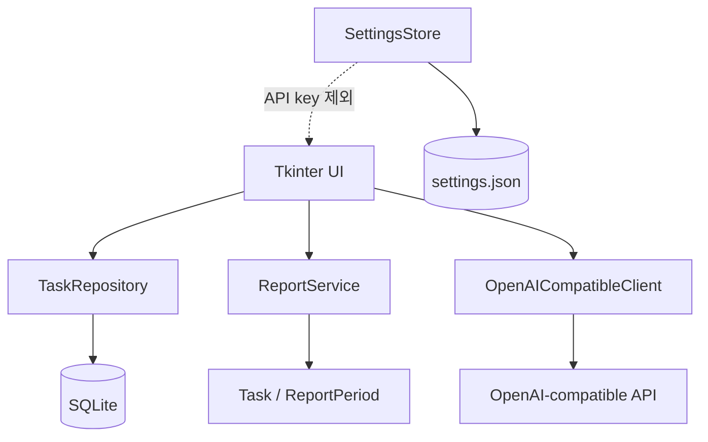
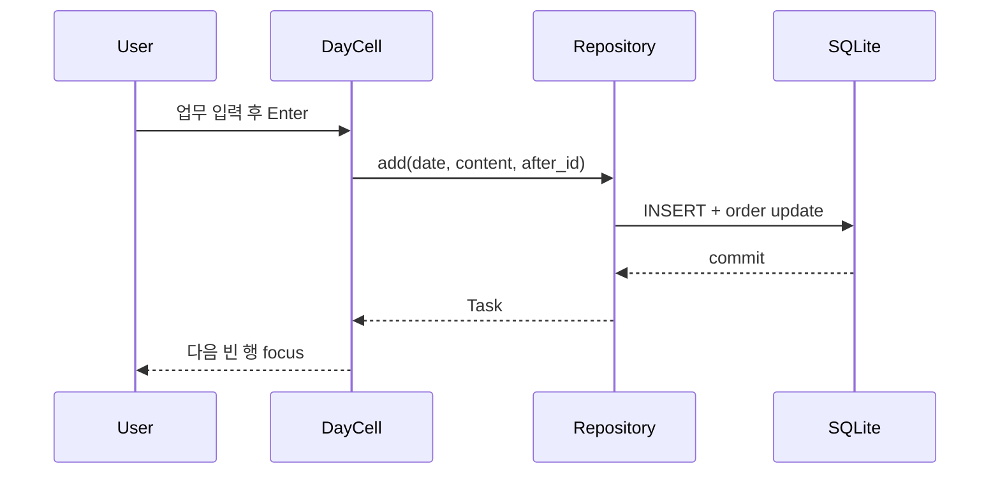
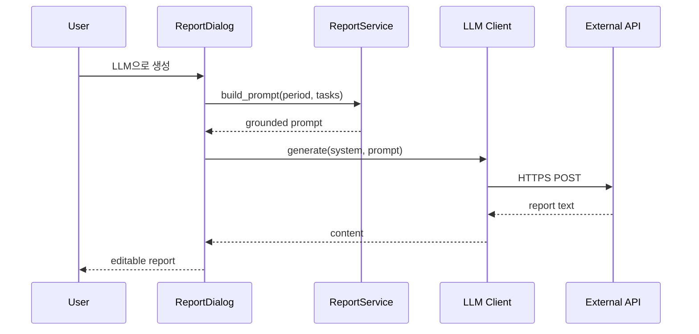

# Architecture

## Overview

## Rationale

첫 버전은 가볍고 설치 의존성이 적어야 하므로 Python 표준 라이브러리만 사용한다.

- Tkinter: 운영체제 데스크톱 창과 입력 위젯
- sqlite3: 트랜잭션이 가능한 로컬 영구 저장
- urllib: 외부 SDK 없이 OpenAI 호환 HTTP 요청
- unittest: 별도 테스트 패키지 없이 검증

## Module Responsibilities

### `app.py`

앱 창, 도구 모음, 월 이동, 날짜 셀 조립을 담당한다. SQL과 LLM 요청 형식은 알지 않는다.

### `ui/day_cell.py`

한 날짜의 업무 목록과 빈 입력 행을 렌더링한다. `Enter`, 체크, 삭제 이벤트를 저장소 작업으로 연결한다.

### `repository.py`

스키마 생성, 업무 CRUD, 정렬, 미완료 이동, 보고서 저장을 담당한다.

### `services/report_service.py`

기간의 업무를 근거가 보존된 LLM 프롬프트 또는 로컬 미리보기로 변환한다.

### `services/llm_client.py`

OpenAI 호환 `chat/completions` 요청과 응답 파싱만 담당한다.

## Runtime Data Flow

## Security Boundary

SQLite와 설정 JSON은 로컬이다. 업무 데이터는 사용자가 LLM 생성 버튼을 누른 경우에만 외부 API로 전송된다. API 키는 프로세스 환경변수에서 읽으며 파일에 쓰지 않는다.
