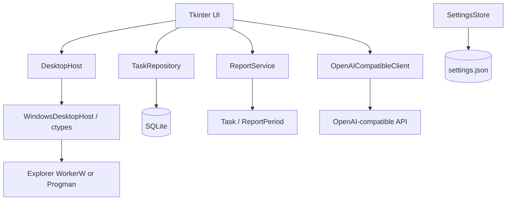
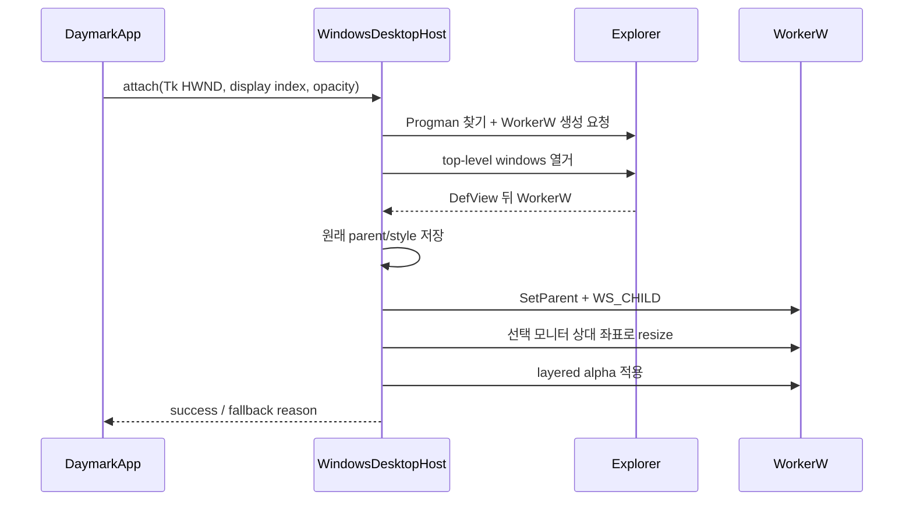

# Architecture

## Overview

## Rationale

Python 표준 라이브러리만 사용한다.

- Tkinter: UI와 입력
- sqlite3: 로컬 저장
- urllib: OpenAI 호환 HTTP
- ctypes: Windows Shell 및 User32 연결
- unittest: 테스트

## Module Responsibilities

### `app.py`

월 달력과 모드 전환을 조립한다. Win32 함수를 직접 호출하지 않고 `DesktopHost`만 사용한다.

### `platform_integration/desktop_host.py`

운영체제 중립 인터페이스, 결과 객체, 비 Windows 안전 폴백을 제공한다.

### `platform_integration/windows_desktop.py`

Win32 모니터 열거, WorkerW/Progman 부모 탐색, 선택 모니터 상대 좌표 계산, `WS_EX_LAYERED` alpha 적용을 담당한다. WorkerW가 가상 데스크톱 전체 크기여도 Daymark 자식 창은 선택 모니터 영역에만 배치한다.

- Progman 탐색과 WorkerW 생성 요청
- `EnumWindows`와 `FindWindowExW`로 아이콘 호스트 뒤 WorkerW 탐색
- Tk 최상위 HWND 해석
- 원래 부모와 스타일 보존
- `SetParent` 및 창 스타일 전환
- 선택 모니터 좌표를 WorkerW 부모 기준으로 변환한 `SetWindowPos`
- `WS_EX_LAYERED`와 `SetLayeredWindowAttributes`로 alpha 재적용
- Explorer 재시작 시 재연결
- 부분 실패 시 원상 복구

WorkerW 생성 메시지는 공개 Win32 계약이 아니므로 이 모듈 밖에서는 WorkerW 존재를 가정하지 않는다.

### `theme.py`

반투명도, 색상, 평면 위젯 옵션을 관리한다.

### `ui/day_cell.py`

한 날짜의 업무 목록과 빈 입력 행을 렌더링한다.

### `repository.py`

SQLite 스키마, CRUD, 정렬, 미완료 이동, 보고서 저장을 담당한다.

### `services/report_service.py`

업무 기록을 근거가 보존된 프롬프트 또는 로컬 요약으로 변환한다.

### `services/llm_client.py`

OpenAI 호환 요청과 응답 파싱만 담당한다.

## Desktop Mode Sequence

## Failure Boundaries

- WorkerW 탐색 실패: 일반 창 유지
- `SetParent` 이후 크기 조정 실패: 원래 부모와 스타일로 롤백
- Explorer 재시작: 2.5초 주기 유지 검사에서 새 부모 탐색
- LLM 또는 네트워크 실패: SQLite와 입력 UI는 계속 동작
- 앱 종료: 가능한 경우 먼저 원래 부모로 분리한 뒤 DB를 닫음

## Security Boundary

업무 데이터는 사용자가 LLM 생성 버튼을 누른 경우에만 외부로 전송된다. API 키는 환경변수에서 읽으며 파일에 쓰지 않는다. Win32 통합은 로컬 창 핸들과 스타일만 다루고 업무 내용에는 접근하지 않는다.
