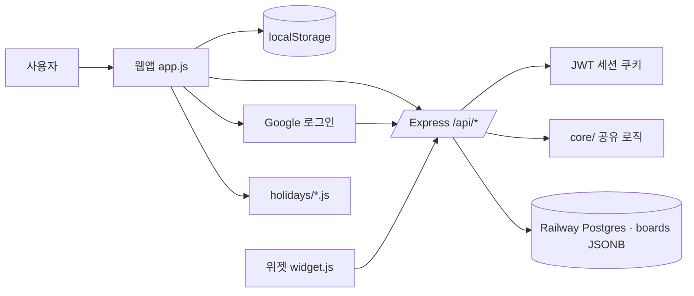
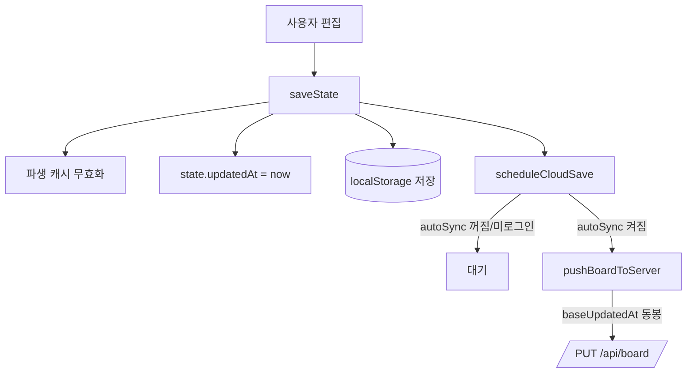
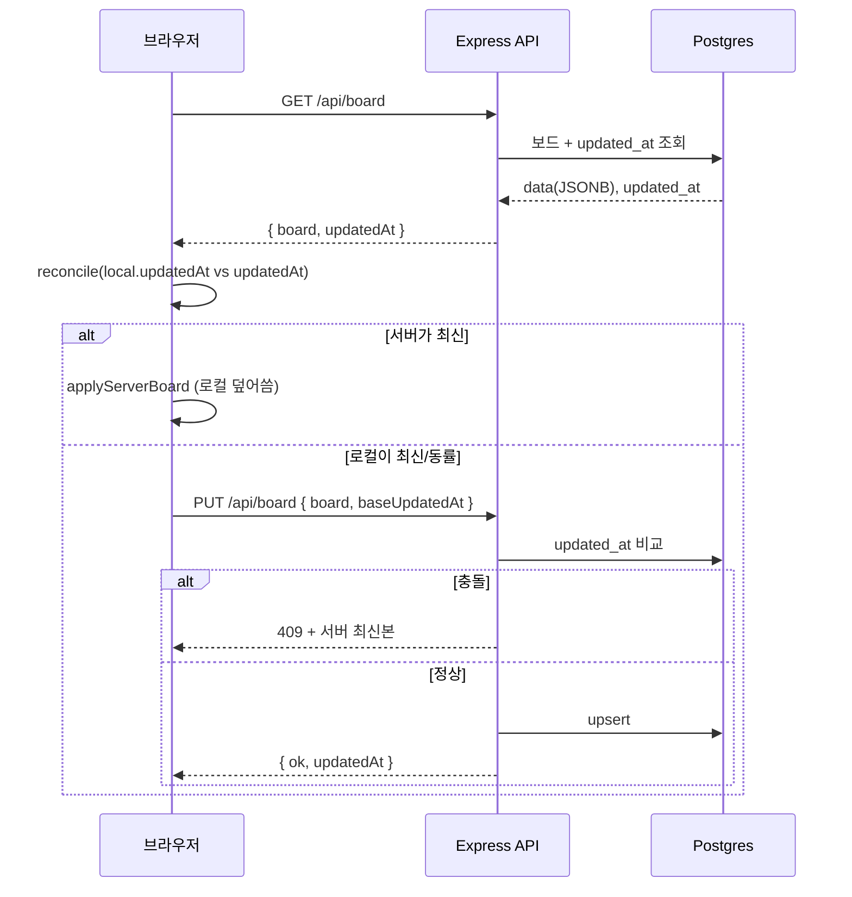

# 아키텍처

> 규칙·불변식은 [`../AGENTS.md`](../AGENTS.md)가 진실의 원천. 이 문서는 "지금 시스템이
> 어떻게 생겼는가"를 설명한다.

## 개요

단일 Express 서비스가 정적 프론트(`index.html` 등)와 `/api/*`를 함께 서빙한다.
Railway 단일 서비스로 배포. 데이터는 사용자당 한 행(JSONB)으로 Postgres `boards`에 저장.

## 레이어와 책임

| 레이어 | 파일 | 책임 |
|--------|------|------|
| 프론트(편집기) | `app.js`, `index.html`, `styles.css` | 타임라인·그래프 렌더, 목표/날짜/컨디션 편집, 로컬 저장, 동기화 오케스트레이션 |
| 위젯(얇은 클라이언트) | `widget.js`, `widget.html`, `widget.css` | 서버 요약 데이터 read + 캘린더/wave 렌더. 계산 로직 없음 |
| 서버 | `server.js` | 정적 서빙 + 인증(구글/JWT) + 보드 CRUD + 위젯 요약 API |
| 공유 코어 | `core/board-schema.js`, `core/board-metrics.js` | 보드 정규화, 업무량·컨디션 계산·보간·예측. **프론트·서버·위젯 공유** |
| 데이터 | `holidays/<연도>.js` | 연도별 공휴일. `<script>` 동적 로드(→ `file://`에서도 동작) |

## 모듈 경계 (불변식)

- **계산은 `core/`에만.** `app.js`/`server.js`/`widget.js`는 `core/`를 호출할 뿐 같은 계산을
  재구현하지 않는다.
- **`core/`는 UMD.** 브라우저 전역(`root.BoardSchema`, `root.BoardMetrics`)과
  CommonJS(`module.exports`) 양쪽 로드. 이 이중성을 깨는 문법 금지.
- **정규화는 서버 진입점에서.** 로드·저장 모두 `normalizeBoard()` 통과.

## 데이터 흐름 — 편집 → 저장

## 데이터 흐름 — 로드/로그인 시 동기화

무조건 덮어쓰지 않고 로컬·서버 중 최신을 채택한다. (상세: [`DATA_MODEL.md`](./DATA_MODEL.md),
근거: [`adr/0002-board-sync-optimistic-locking.md`](./adr/0002-board-sync-optimistic-locking.md))

## 배포

- Railway 단일 서비스 + PostgreSQL. 앱의 `DATABASE_URL`을 `${{Postgres.DATABASE_URL}}`로 참조.
- 필수 Variables: `GOOGLE_CLIENT_ID`, `JWT_SECRET`, `NODE_ENV=production`.
- 값이 없으면 동기화가 꺼지고 `localStorage` 전용으로 폴백. `JWT_SECRET`은 prod에서 필수(없으면 기동 실패).
